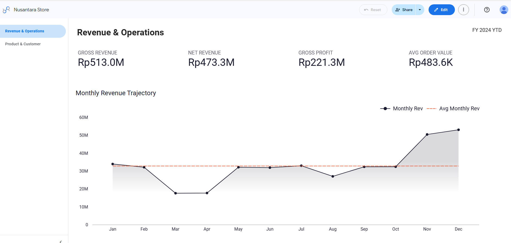
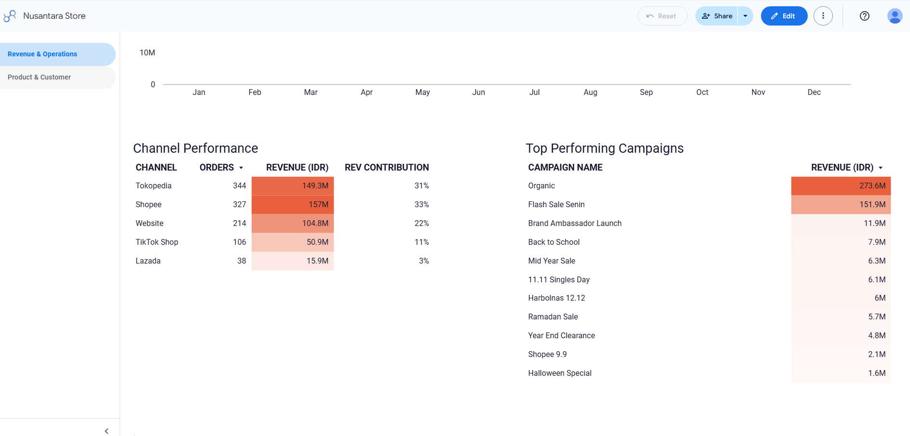
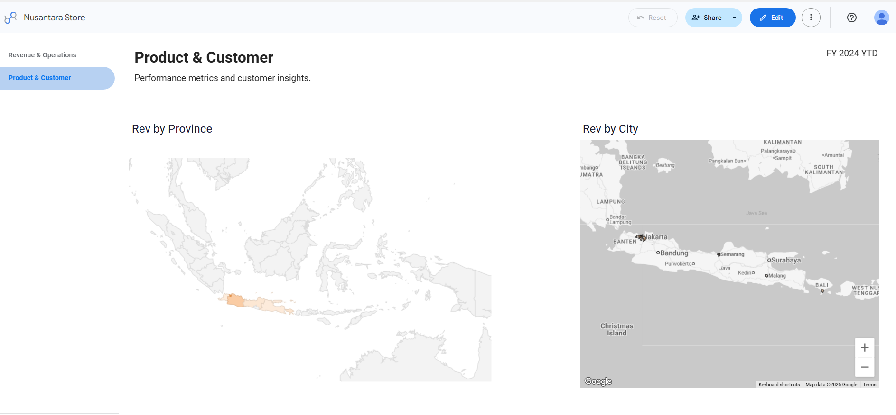
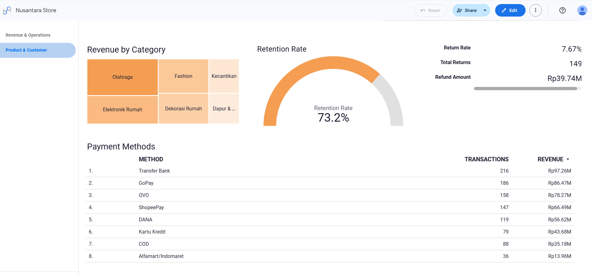

# Nusantara Store — E-Commerce Sales Analysis


**Tools:** SQL (BigQuery) · Looker Studio  
**Dataset:** Simulated Indonesian e-commerce dataset — 6 tables, 4,200+ rows  
**Dashboard:** [View Live Dashboard](https://datastudio.google.com/reporting/99c0eb71-0022-4c74-9aeb-090cac4ed16b)

---

## Overview

Nusantara Store is a simulated Indonesian e-commerce brand selling lifestyle and home goods across five channels: Tokopedia, Shopee, Website, TikTok Shop, and Lazada.

This project simulates a real analyst engagement — starting from raw transactional data in BigQuery, writing SQL queries to answer business questions from different stakeholders (CFO, Head of Marketing, Head of CRM), and delivering findings through an interactive Looker Studio dashboard.

The dataset was designed to reflect realistic Indonesian e-commerce patterns including seasonal demand spikes (Harbolnas, Ramadan), multi-channel sales distribution, and customer return behavior.

---

## Business Questions Answered

| # | Stakeholder | Question |
|---|---|---|
| Q1 | CFO | What is our full year P&L — gross revenue, COGS, gross profit, and margin? |
| Q2 | CEO | How did monthly revenue trend across 2024? Which months beat the average? |
| Q3 | Finance | What is net revenue after approved returns? What is our return rate? |
| Q4 | Head of Product | Which are our top 10 best selling products by revenue and margin? |
| Q5 | Category Manager | How does each product category perform by revenue, margin, and return rate? |
| Q6 | Head of Marketing | Which sales channel drives the most revenue and orders? |
| Q7 | Marketing Manager | Which campaigns generated the most revenue? How do campaign orders compare to organic? |
| Q8 | Head of CRM | What percentage of revenue comes from repeat vs first-time customers? |
| Q9 | Regional Manager | Which cities and provinces generate the most revenue? |
| Q10 | COO | What is the most popular payment method by orders, revenue, and AOV? |

---

## Dashboard Preview

<a href="https://datastudio.google.com/reporting/99c0eb71-0022-4c74-9aeb-090cac4ed16b">
  
</a>
<a href="https://datastudio.google.com/reporting/99c0eb71-0022-4c74-9aeb-090cac4ed16b">
  
</a>

**Page 1 — Revenue & Operations**
- 4 KPI scorecards: Gross Revenue, Net Revenue, Gross Profit, AOV
- Monthly revenue trend with average reference line
- Channel performance table
- Campaign revenue ranking


<a href="https://datastudio.google.com/reporting/99c0eb71-0022-4c74-9aeb-090cac4ed16b">
  
</a>
<a href="https://datastudio.google.com/reporting/99c0eb71-0022-4c74-9aeb-090cac4ed16b">
  
</a>

**Page 2 — Product & Customer**
- Indonesia geo map — revenue by province and city
- Revenue by product category (treemap)
- Repeat vs new customer retention rate
- Return rate and refund summary
- Payment method breakdown

---

## Dataset

Designed to simulate a real Indonesian e-commerce operation with seasonal patterns, multi-channel distribution, and realistic customer behavior.

| Table | Rows | Description |
|---|---|---|
| `orders` | 1,200 | Order-level data — channel, payment method, campaign, status, totals in IDR |
| `order_items` | 2,259 | Line items per order — product, quantity, unit price, discount, COGS |
| `customers` | 500 | Indonesian customer demographics — city, province, membership status |
| `products` | 30 | Product catalog across 6 categories — IDR pricing, COGS, margin % |
| `campaigns` | 10 | Marketing campaigns — Harbolnas, Ramadan Sale, 11.11, Flash Sale, etc. |
| `returns` | 239 | Return and refund records — reason, status, refund amount |

**Data characteristics:**
- All monetary values in IDR (Indonesian Rupiah)
- USD equivalent calculated using fixed rate: 1 USD = Rp 15,750
- Seasonal demand patterns built in — Q4 peak, March/April dip
- ~20% of orders have associated returns
- 45% of orders during campaign windows receive discounts

### Schema

```
orders ──────────────── order_items ──── products
   │                         │
   ├── order_item_refunds ───┘
   │
   └── website_sessions (channel source)

customers ──── orders
campaigns ──── orders
```

---

## SQL Queries

All queries are in the `/queries` folder. Each file follows this structure:

```sql
-- Q#: [Title]
-- Purpose: [Business question being answered]
-- Stakeholder: [Who asked for this]
-- Scope: [Filters applied — completed orders, date range, etc.]
-- Tables: [Tables used]

SELECT ...
```

### SQL Concepts Demonstrated

| Concept | Used in |
|---|---|
| Multi-table JOINs (2-4 tables) | Q3, Q4, Q5, Q7, Q8, Q9 |
| LEFT JOIN with NULL handling (COALESCE) | Q3, Q5, Q7 |
| Window functions — `SUM(SUM()) OVER()` | Q2, Q6, Q8, Q10 |
| Window functions — `AVG(SUM()) OVER()` | Q2 |
| CTEs (Common Table Expressions) | Q8 |
| CASE statements | Q2, Q8 |
| Date filtering with EXTRACT | Q1–Q10 |
| CAST and type conversion | Q1–Q10 |
| ROUND and number formatting | Q1–Q10 |
| Aggregations with GROUP BY | Q1–Q10 |

---

## Key Findings

**Revenue**
- Total gross revenue FY2024: Rp 513M (~$32,600 USD)
- Net margin after COGS: ~43%
- March and April showed a significant revenue dip — consistent with post-Chinese New Year demand correction before Ramadan season

**Channels**
- Shopee (33%) and Tokopedia (31%) combined drive 64% of total revenue
- Website contributes 22% — healthy for a D2C brand with owned channel presence
- TikTok Shop at 11% is the fastest growing channel to monitor
- Lazada at 3% is underperforming and may not justify continued investment

**Products & Categories**
- Olahraga (Sports) dominates the top 10 products by revenue — 3 of the top 5 products are sports items
- Sepatu Running Unisex is the single highest revenue product
- Margin is consistent across all categories (48–60%) indicating healthy and stable pricing structure

**Customers**
- 87% of revenue comes from repeat customers — strong retention signal
- October has the highest return rate at 14.16% — a potential quality or fulfillment issue to investigate before peak season

**Campaigns**
- Organic (non-campaign) orders still account for the largest revenue share
- Flash Sale Senin drives consistent volume as a recurring weekly campaign
- Harbolnas 12.12 generates the highest AOV among all campaigns

---

## How to Reproduce

**1. Set up BigQuery**
- Create a BigQuery dataset called `nusantara_store`
- Upload all 6 CSV files from `/data` as tables (auto-detect schema)

**2. Run queries**
- Open each `.sql` file in `/queries`
- Run against `your-project.nusantara_store`

**3. Connect to Looker Studio**
- Go to lookerstudio.google.com → Create → Report
- Add data source → BigQuery → Custom Query
- Paste each query as a separate data source
- Build charts on top of the pre-aggregated query results

---

## About

**Wahyu Kwan** — Freelance Data Analyst based in Jakarta, Indonesia.  
~4 years experience in strategy and campaign operations at Grab and Moladin.  
Specializing in e-commerce and sales performance dashboards for Indonesian businesses.

**Tools:** SQL · Tableau · Looker Studio · Power BI · Excel · BigQuery  
**Portfolio:** [wahyukwan.com](https://wahyukwan.com)
**LinkedIn:** [linkedin.com/in/wahyukwan](https://linkedin.com/in/wahyukwan)  
**Email:** wahyukwan@gmail.com
